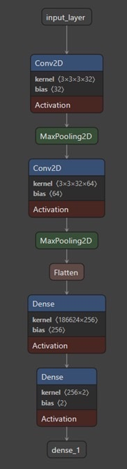

# **Plant Leaf Disease Detection using AI**

This application uses **Deep Learning** to detect diseases in plant leaves through **Computer Vision** and **Machine Learning** techniques.

---

## **Setup Instructions**

### 1. Create a Virtual Environment:
```bash
python -m venv venv
source venv/Scripts/activate  # For Windows
```

### 2. Install Required Packages:
```bash
pip install -r requirements.txt
```

### 3. Train the Model:  
Ensure the dataset is present in the required structure before running the training script.
```bash
python model_training.py
```

### 4. Run the Streamlit Application:  
```bash
streamlit run app.py
```

---

## **Project Structure**

```
Project_Final/
├── dataset/
│   ├── test/
│   │   ├── diseased/
│   │   └── healthy/
│   └── train/
│       ├── diseased/
│       └── healthy/
├── app.py
├── model_training.py
├── requirements.txt
├── README.md
├── plant_disease_model.h5 (generated after training)
└── architecture.png (model architecture visualization)
```

---

## **Model Architecture**

Below is a visualization of the **Convolutional Neural Network (CNN)** architecture used in this project:  

  

### Key Features:
- **Multiple Convolutional and Pooling Layers**: For feature extraction.  
- **Dropout**: To prevent overfitting.  
- **Data Augmentation**: To enhance generalization.  
- **Input Image Size**: 224x224 pixels.  
- **Output Classes**: 8 classes (healthy and diseased for 4 plant types).

---

## **Supported Plants**

- **Apple**  
- **Peach**  
- **Potato**  
- **Strawberry**  

---

## **Usage**

1. Run the Streamlit application using the command:
   ```bash
   streamlit run app.py
   ```
2. Open your web browser and navigate to the URL displayed in the terminal (usually [http://localhost:8501](http://localhost:8501)).
3. **Upload** an image of a plant leaf using the file uploader.  
4. Click the **"Analyze Image"** button.  
5. View the results, which display whether the leaf is **healthy** or **diseased**, along with a **confidence score**.  

---

## **Dataset and Model Details**

The dataset is curated from different sources online, and can be seen [here](https://drive.google.com/drive/folders/1f_EG4p3DtMNB1YKx7NAfJwGVB_fuqwzx?usp=sharing).

The model uses a **Convolutional Neural Network (CNN)** architecture with:
- **Input Image Size**: 224x224 pixels.  
- **Output Classes**: 8 (healthy and diseased for 4 plant types).  
- **Dropout Layers**: To reduce overfitting.  
- **Data Augmentation**: For better generalization.  

---

## **Future Directions**

The project aims to expand by including more plant species and diseases, optimizing the model for faster inference, and integrating IoT systems for real-time monitoring. Multilingual support and mobile app development are also planned for wider accessibility.

---
